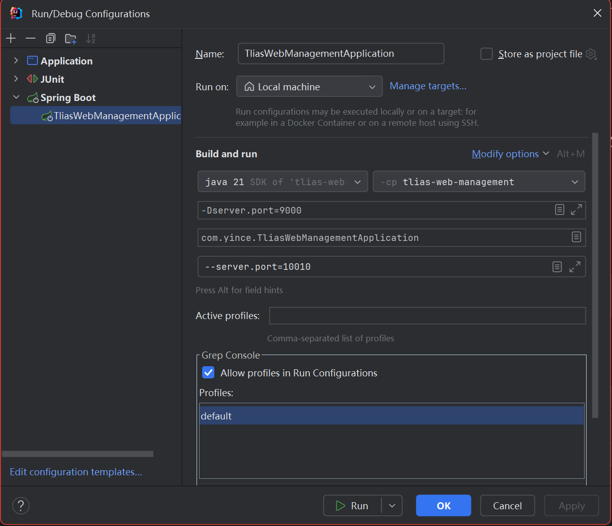

# Day 01 = 2025-2-24

## 今日内容

1. Mybatis 默认数据封装规则
2. 如果字段名与实体类属性名不一致？
3. 接受参数的注解: @RequestParam
4. 接受请求体的注解: @RequestBody
5. ### Mybatis 默认数据封装规则

   * 实体类名属性名 和 数据库表的字段名一致， mybatis会自动封装
6. ### 如果字段名与实体类属性名不一致？

   * 手动结果映射 @Result({....})
   * sql语句起别名
   * 开启camel命名开关
7. ### 接受参数的注解: @RequestParam
8. ### 接受请求体的注解: @RequestBody

## Point

### 获取请求中发送的参数

```markdown
请求格式:
    http://localhost:8080/depts?id=1
```

```java
@RequestParam(value = "属性名", required = "true") Integer id;
```

### 获取请求体中的参数

```java
@RequestBody User user;
```

### 注意事项：

Mapper层中 接口传入的参数若是一个封装实体，则#{}内直接填属性就行，不用"对象.属性"

### 遇到的问题

1. lombok失效:
   **删除pom.xml中的有关lombok的build标签，固定lombok的版本，在dependency中**

# Day 02 = 2025-2-25

## 今日内容:

1. 查询回显
2. @RequestMapping
3. 日志记录
4. 分页查询

### 1. 查询回显

路径参数: 通过请求URL直接传递参数, 使用{...}来标识该路径参数, 需要使用 @PathVariable 获取

```markdown
请求格式:
    http://localhost:8080/depts/1
```

格式：

```java
public Result get(@PathVariable("id") Integer id) {
   ;
}
// 若PathVariable中的属性值与参数名一致，可以简化为
public Result get(@PathVariable Integer id) {}
```

### 2. @RequestMapping

若一个Controller中所有方法的请求路径相同，则可以使用@RequestMapping注解 抽取到这个类上,
里面的方法就不要再补充GetMapping,RestMapping,PostMapping中的value值了

```java
@RequestMapping("/depts")
@RestController
public class DeptController {
    ;
}
```

### 3. 日志记录

JUL: JavaSE官方提供的日志框架

Log4j: 一个流行的日志框架, 提供了灵活的配置选项, 支持多种输出目标

Logback: 基于Log4j的轻量级日志框架, 配置简单, 性能高

SLF4J: 简单日志门面,一个日志统一接口, 不提供具体实现，支持多种日志框架

#### Logback 快速入门

```
引入logback的依赖(SpringBoot项目中该依赖已经传递下来了)
配置logback.xml文件

可以配置日志输出的格式、位置、输出目标、开关

具体配置文件地址:
tlias-web-management/src/main/resources/logback.xml
有详细注释

log日志级别(从低到高):
   level: ALL> TRACE> DEBUG> INFO> WARN> ERROR> FATAL> OFF
   默认级别: INFO
      ALL: 所有
      TRACE: 追踪
      DEBUG: 调试 (视为最低级别日志，记录调试过程)
      INFO: 信息 (记录一般信息，描述程序运行的关键事件)
      WARN: 警告 (记录程序运行过程中可能引起问题的事件)
      ERROR: 错误 (记录程序运行过程中的错误信息)
      FATAL: 致命 
      OFF: 关闭
```

### 4.分页查询

```markdown
1. 引入分页插件
    是Mybatis框架中用来实现分页的插件，简化分页操作，提高开发效率
2. 在查询方法上添加@PageHelper注解
```

```json
{
   "code": 1,
   "msg": "查询成功",
   "data": {
      "total": 2,
      "rows": [
         {
            "id": 1,
            "name": "技术部"
         },
         {
         }
      ]
   }
}
```

## Point

### 若多表查询结果中有字段在实体类中不存在，则需要手动添加封装该字段

# Day 03 = 2025-2-28

## 今日内容

1. 条件分页查询优化
   1. 优化参数，将参数封装为一个实体类
   2. 动态SQL, 优化SQL语句，某些查询条件可以为空,可以模糊匹配
2. 新增员工
   1. 新增员工基本信息
   2. 新增员工经历信息（批量插入）
3. 事务管理

### 查询参数封装实体类

```java
public class EmpQueryParam {
   private Integer page = 1;
   ;
//   其余参数
}
```

### Mybatis中的动态 SQL

1. <where> 根据查询条件来生成 `where`关键字，自动去除多余的and或者or

### 批量插入

动态SQL
`<foreach>标签`，
`collection`指定集合、列表，
`item` 指定item名，
`separator` 指定分隔符
`open` 遍历开始前拼接的片段（可选）`close` 遍历结束后拼接的片段（可选）

```xml
<insert id="insertBatch">
        insert into emp_expr(emp_id,begin,end,company,job) values
        <foreach collection="exprList" item="expr" separator=",">
            (#{expr.empId},#{expr.begin},#{expr.end},#{expr.company},#{expr.job})
        </foreach>
    </insert>
```

#### 主键回显

`@Options(useGeneratedKeys = true)`获取到生成的主键，返回主键赋值给emp中的id

```java
@Options(useGeneratedKeys = true, keyProperty = "id")
    @Insert("insert into emp(username, name, gender, phone, job, salary, image, entry_date, dept_id, create_time, update_time) " +
    "values (#{username}, #{name},#{gender},#{phone},#{job},#{salary},#{image},#{entry_date},#{deptId},#{createTime},#{updateTime})")
    void insert(Emp emp);
```

### 事务管理

thinking: 保存emp成功了，而保存empExpr失败了，该怎么办？

* `@Transactional`注解
* 作用：将当前方法交给spring进行事务管理，方法执行前，开启事务；成功执行完毕，提交事务；出现异常，回滚事务
* 位置：最好加在（操作了两次及以上数据库）业务层的方法上，而不是类或者接口
* 要在 `application.yml`中配置事务管理相关

#### 指定异常回滚

> 指定出现某种异常，回滚事务,@Transactional默认RuntimeException（运行异常）才回滚

* `RollbackFor` 参数

  ```java
  @Transactional(rollbackFor = {Exception.class})
  ```

#### 事务的传播行为

> 当一个事务方法被另一个事务方法调用时，这个事务方法该如何进行事务表现

* `propagation `
  ```java
  @Transaction(propagation = Propagation.REQUIRED)
  ```


| 属性值        | 含义                             |
| ------------- | -------------------------------- |
| REQUIRED      | 【默认】有则加入，无则创建新事物 |
| REQUIRES_NEW  | 无论有无，总是创建新事物         |
| SUPPORTS      | 有则加入，无则在无实物状态中运行 |
| NOT_SUPPORTED | 如过有事务，则挂起               |
| MANDATORY     | 必须有事务，否则异常             |
| NEVER         | 必须没事务，否则异常             |

### try - finnally 语法

```java
try {
...
} finally {
...总会执行
}
```

# Day 04 2025-3-1

## 今日内容

1. 文件上传
2. 对象存储服务OSS
3. 员工管理中的(员工删除，员工查询，员工管理)

### 文件上传

```html
 <form action="/upload" id="uploadForm" method="post" enctype="multipart/form-data">
    姓名： <input type="text" name="name">
    图像： <input type="file" name="file">
    <input type="submit" value="上传文件" name="submit">
</form>
```

#### 要点

1. 必须为 post 请求方式
2. enctype 必须为 multipart/form-data
3. 有一个文件上传的表单项 type="file"
4. 后端有一个 `MultipartFile file` 来接受文件

#### UUID

```java
String suffix = originalFileName.substring(originalFileName.lastIndexOf(".")); //获取文件名，从后到前第一个"."（包括）开始截取
String newFileName = UUID.randomUUID().toString() + suffix; //UUID工具类，生成随机字符串
```

### 阿里云OSS(Object Storage Service)

1. 开通云存储服务
2. 创建Bucket
3. 获取并配置AccessKey（秘钥）

`set OSS_ACCESS_KEY_ID=`+你的accessKey ID
`set OSS_ACCESS_KEY_SECRET`+你的AccessKey Secret



4. 引入阿里云OSS依赖

```xml
        <!--阿里云OSS-->
        <dependency>
            <groupId>com.aliyun.oss</groupId>
            <artifactId>aliyun-sdk-oss</artifactId>
            <version>3.18.1</version>
        </dependency>
        <!--JAXB相关依赖-->
        <dependency>
            <groupId>javax.activation</groupId>
            <artifactId>activation</artifactId>
            <version>1.1.1</version>
        </dependency>
        <dependency>
            <groupId>org.glassfish.jaxb</groupId>
            <artifactId>jaxb-runtime</artifactId>
            <version>2.3.3</version>
        </dependency>
```

5. 引入阿里云OSS工具类

将阿里云官方示例代码转换为工具类，让其更加通用

```java
@Component
public class AliyunOSSOperator {
    @Autowired
    private AliyunOSSProperties aliyunOSSProperties;

    public String upload(byte[] content, String originalFileName) throws Exception {
        // 从环境变量中获取访问凭证。运行本代码示例之前，请确保已设置环境变量OSS_ACCESS_KEY_ID和OSS_ACCESS_KEY_SECRET。
        EnvironmentVariableCredentialsProvider credentialsProvider = CredentialsProviderFactory.newEnvironmentVariableCredentialsProvider();
        // 填写Object完整路径，完整路径中不能包含Bucket名称，例如exampledir/exampleobject.txt。
        // 获取当前系统时间
        String uploadTime = LocalDate.now().format(DateTimeFormatter.ofPattern("yyyy/MM"));
        // 构建一个新的不重复的文件名
        String dir = uploadTime + "/";
        // 获取文件后缀名
        assert originalFileName != null; // 断言，如果为空则抛出异常
        String suffix = originalFileName.substring(originalFileName.lastIndexOf("."));
        // 通过UUID生成新的文件名
        String newFileName = UUID.randomUUID().toString() + suffix;
        // 通过不同后缀判断存在哪一个文件夹(使用switch)
        dir = switch (suffix) {
            case ".jpg", ".png", ".gif" ->
                // 保存图片
                    uploadTime + "/images";
            case ".mp4", ".avi" ->
                // 保存视频
                    uploadTime + "/videos";
            case ".mp3", ".wav" ->
                // 保存音频
                    uploadTime + "/audios";
            case ".txt", ".pdf", ".doc", ".docx" ->
                // 保存文档
                    uploadTime + "/documents";
            default ->
                // 保存其他文件
                    uploadTime + "/others";
        };
        String objectName = dir + "/" + newFileName;
        // 创建OSSClient实例。
        ClientBuilderConfiguration clientBuilderConfiguration = new ClientBuilderConfiguration();
        clientBuilderConfiguration.setSignatureVersion(SignVersion.V4);
        OSS ossClient = OSSClientBuilder.create()
                .endpoint(endpoint)
                .credentialsProvider(credentialsProvider)
                .clientConfiguration(clientBuilderConfiguration)
                .region(region)
                .build();
        // 上传文件
        try {
            ossClient.putObject(bucketName, objectName, new ByteArrayInputStream(content));
        } finally {
            ossClient.shutdown();
        }
        return endpoint.split("//")[0] + "//" + bucketName + "." + endpoint.split("//")[1] + "/" +objectName;
    }
}
```

7. 优化代码，将工具类需要的属性封装为一个实体类

```java
@Data
@Component
@ConfigurationProperties(prefix = "aliyun.oss")
public class AliyunOSSProperties {
    private String endpoint;
    private String bucketName;
    private String region;
}
```

### 员工管理

#### 员工删除

> 请求路径：/emps
>
> 请求方式：DELETE
>
> 参数类型：QueryParam: ids
>
> 参数实例：/emp?ids=1,2,3
>
> 返回类型：application/json

```xml
    <!-- 根据员工id批量删除员工工作经历信息-->
    <delete id="deleteByEmpIds">
        delete from emp_expr where emp_id in
        <foreach collection="empIds" item="empId" open="(" close=")" separator=",">
            #{empId}
        </foreach>
    </delete>
```

1. 根据员工id批量删除员工的基本信息
2. 根据员工id批量删除员工的工作经历信息

#### 查询员工

ResultMap

一个员工对应多个工作信息，要在xml中手动封装

```xml
    <!--根据id查询员工基本信息和工作经历信息-->
    <resultMap id="empResultMap" type="com.yince.pojo.Emp">
        <id column="id" property="id"/>
        <result column="username" property="username"/>
        <result column="name" property="name"/>
        <result column="gender" property="gender"/>
        <result column="phone" property="phone"/>
        <result column="job" property="job"/>
        <result column="salary" property="salary"/>
        <result column="image" property="image"/>
        <result column="entry_date" property="entryDate"/>
        <result column="dept_id" property="deptId"/>
        <!--封装工作经历信息-->
        <collection property="exprList" ofType="com.yince.pojo.EmpExpr">
            <id column="ee_id" property="id"/>
            <result column="ee_begin" property="begin"/>
            <result column="ee_end" property="end"/>
            <result column="ee_company" property="company"/>
            <result column="ee_job" property="job"/>
        </collection>
    </resultMap>
```

#### 修改员工

1. 根据id修改员工的基本信息
2. 修改员工的工作经历信息

   1. 先删除
   2. 再增加

# Day 05 = 2025-3-2

## 今日内容

### 修改员工SQL优化

要修改哪个字段才动态生成这条字段SQL

```xml
<!--<SET>标签：自动生成set关键字，自动删除多余","-->
<update id="updateById" parameterType="map">
    UPDATE emp
    <set>
        <if test="username != null and username != ''">username = #{username},</if>
        <if test="name != null and name != ''">name = #{name},</if>
        <if test="gender != null">gender = #{gender},</if>
        <if test="phone != null and phone != ''">phone = #{phone},</if>
        <if test="job != null">job = #{job},</if>
        <if test="salary != null and salary != ''">salary = #{salary},</if>
        <if test="image != null and image != ''">image = #{image},</if>
        <if test="entryDate != null">entry_date = #{entryDate,jdbcType=DATE},</if>
        <if test="deptId != null">dept_id = #{deptId},</if>
        <if test="updateTime != null">update_time = #{updateTime}</if>
    </set>
    WHERE id = #{id}
</update>
```

### 全局异常处理器

若服务端出错，给前端反馈

@RestControllerAdvice = @ControllerAdvice + @ResponseBody

```java
@Slf4j
@RestControllerAdvice
public class GlobalExceptionHandler {

    @ExceptionHandler
    public Result handleException(Exception e) {
        log.error("服务端出错: ",e);
        return Result.error("服务端出错,可联系管理员WeChat: YinceBoulevard");
    }

    @ExceptionHandler
    public Result handlerDuplicateKeyException(DuplicateKeyException e) {
        log.error("数据库主键重复: ",e);
        String message = e.getMessage();
        int i = message.indexOf("Duplicate entry");
        String errMsg = message.substring(i);
        String[] arr = errMsg.split(" ");
        return Result.error(arr[2] + " 已存在");
    }
}
```

### 数据可视化

#### 职位信息统计

核心: 查询到的数据如何封装？

```java
    /**
     * 获取员工岗位数据
     * @return
     */
    @Override
    public JobOption getEmpJobData() {
        // 1. 调用mapper接口获取统计数据
        List<Map<String, Object>> list = empMapper.countEmpJobData();
        // 2. 组装结果并返回
        /* list:
        * pos=教研主管,num=1
        * */
        List<Object> jobList = list.stream().map(dataMap -> dataMap.get("pos")).toList();
        List<Object> numList = list.stream().map(dataMap -> dataMap.get("num")).toList();
        return new JobOption(jobList, numList);
    }
```

#### 性别信息统计

### 班级管理

#### 条件分页查询班级

1. 统一条件分页查询结果封装实体类 PageResult
2. Result 包含 PageResult
3. 要先把查询数据封装到 PageResult 再把PageResult封装到Result
4. 其中 PageResult 中包含 total(总记录数)和rows(实际的数据)
5. 查询参数过多，可以封装为一个实体类 ClazzQueryParm

#### 新增班级

#### 删除班级

#### 修改班级

### 学员管理

#### 学员列表查询（条件查询）条件查询

# Day 06 = 2025-3-3 17:55:07

## 今日内容

### 学生管理

#### 删除学生

批量删除学生

#### 添加学员

#### 根据id查询学生信息

#### 修改学生信息

### 违纪处理相关

违纪分数 = 上一次 + 本次违纪扣分

违纪次数要加一

### 数据统计（可视化）

#### 学生学历统计

#### 班级人数统计

### 项目优化

当部门下有员工时则不允许删除该部门，并给前端提示错误信息：对不起，当前部门下有员工，不能直接删除！

# Day 07 = 2025-3-4 18:39:27

## 今日内容

### 登录

分析：根据用户名和密码查询

当用户没有登录，跳转到登录页面

### 登录校验

#### 会话技术

1. Cookie
2. Session
3. 令牌
   优点:

   1. 支持PC、移动端
   2. 解决集群环境下的认证问题
   3. 减轻服务器端的压力

#### JWT令牌

组成：

1. Header 头,记录令牌类型、签名算法
2. Payload 有效载荷,携带一些自定义信息、默认信息
3. Signature 签名, 防止Token被篡改、确保安全性。将header、payload融入，并加入指定秘钥、通过指定签名算法设计而来

Header:

```json
{
  "alg": "HS256",
  "typ": "JWT"
}
```

Payload:

```json
{
  "sub": "1234567890",
  "name": "John Doe",
  "iat": 1516239022
}
```

步骤：

引入相关依赖

```xml
        <!-- JWT-->
        <dependency>
            <groupId>io.jsonwebtoken</groupId>
            <artifactId>jjwt</artifactId>
            <version>0.9.11</version>
        </dependency>
```

> 最新0.12.x版本中很多方法都被弃用
>
> 建议以后进阶对新版本的jjwt进行学习

注册的声明（建议但不强制使用）：
iss: jwt签发者
sub: jwt所面向的用户
aud: 接收jwt的一方
exp: jwt的过期时间，这个过期时间必须要大于签发时间
nbf: 定义在什么时间之前，该jwt都是不可用的.
iat: jwt的签发时间
jti: jwt的唯一身份标识，主要用来作为一次性token,从而回避重放攻击。

```java
@Component
public class JwtUtils {

    /**
     * 生成jwt
     * 使用Hs256算法, 私匙使用固定秘钥
     *
     * @param secretKey jwt秘钥
     * @param ttlMillis jwt过期时间(毫秒)
     * @param claims    设置的信息
     * @return
     */
    public static String createJwt(String secretKey, long ttlMillis, Map<String, Object> claims) {
        // 指定签名的时候使用的签名算法，也就是header那部分
//        SignatureAlgorithm signatureAlgorithm = SignatureAlgorithm.HS256;

        // 生成JWT的时间
        long expMillis = System.currentTimeMillis() + ttlMillis;
        Date exp = new Date(expMillis);

        //生成 HMAC 密钥，根据提供的字节数组长度选择适当的 HMAC 算法，并返回相应的 SecretKey 对象。
        SecretKey key = Keys.hmacShaKeyFor(secretKey.getBytes(StandardCharsets.UTF_8));

        // 设置jwt的body
        JwtBuilder builder = Jwts.builder()
                // 设置签名使用的签名算法和签名使用的秘钥
                .signWith(key)
                // 如果有私有声明，一定要先设置这个自己创建的私有的声明，这个是给builder的claim赋值，一旦写在标准的声明赋值之后，就是覆盖了那些标准的声明的
                .claims(claims)
                // 设置过期时间
                .expiration(exp);
        return builder.compact();
    }

    /**
     * Token解密
     *
     * @param secretKey jwt秘钥 此秘钥一定要保留好在服务端, 不能暴露出去, 否则sign就可以被伪造, 如果对接多个客户端建议改造成多个
     * @param token     加密后的token
     * @return
     */
    public static Claims parseJWT(String secretKey, String token) {

        //生成 HMAC 密钥，根据提供的字节数组长度选择适当的 HMAC 算法，并返回相应的 SecretKey 对象。
        SecretKey key = Keys.hmacShaKeyFor(secretKey.getBytes(StandardCharsets.UTF_8));

        // 得到DefaultJwtParser
        JwtParser jwtParser = Jwts.parser()
                // 设置签名的秘钥
                .verifyWith(key)
                .build();
        Jws<Claims> jws = jwtParser.parseSignedClaims(token);
        Claims claims = jws.getPayload();
        return claims;
    }
}

```

```xml
# 秘钥、过期时间、用户token名称配置
com:
  jwt:
    user-secret-key: lbw
    user-ttl: 7200000
    user-token-name: authentication
```

```java
@Data
@Component
@ConfigurationProperties(prefix = "com.jwt")
public class JwtProperties {

    /**
     * 用户端用户生成jwt令牌相关配置
     */
    private String userSecretKey;
    private long userTtl;
    private String userTokenName;
}
```

生成JWT令牌

```java
//登陆controller中生成，返回给客户端
Map<String, Object> claims = new HashMap<>();
claims.put(JwtClaimsConstant.USER_ID,user.getId());
claims.put(JwtClaimsConstant.USERNAME,user.getUsername());
String token = JwtUtils.createJwt(
    jwtProperties.getUserSecretKey(),
    jwtProperties.getUserTtl(),
    claims
);
```

解析

```java
//在拦截器中
Claims claims = JwtUtils.parseJWT(jwtProperties.getUserSecretKey(), token);
//claims就是在Pyload中存放的用户信息
claims.get("keyname")
```


#### 过滤器 Filter

#### 拦截器 Interceptor

> 动态拦截方法调用的机制，Spring 框架中提供的
>
> 作用：拦截请求，在指定的方法调用前后，根据业务需要执行预先设定的代码

Step:

1. 定义拦截器

   ```java
   @Component
   public class TokenInterceptor implements HandlerInterceptor {
       @Autowired
       private JwtUtils jwtUtils;
       @Autowired
       private JwtProperties jwtProperties;
       /**
        * 请求处理之前调用
        * @param request 请求
        * @param response 响应
        * @param handler 处理器
        * @return
        * @throws Exception
        */
       @Override
       public boolean preHandle(HttpServletRequest request, HttpServletResponse response, Object handler) throws Exception {
           // 3. 如果不是登录请求，则需要校验token
           String token = request.getHeader("token");

           // 判断token是否为空
           if (token == null || token.isEmpty()) {
               // 响应错误信息
               response.setStatus(HttpServletResponse.SC_UNAUTHORIZED);
               response.getWriter().write("token is null");
               return false;
           }
           // 校验token
           try {
               // 获取token
               Claims claims = jwtUtils.parseJWT(jwtProperties.getUserSecretKey(), token);
           } catch (Exception e) {
               // 响应错误信息
               response.setStatus(HttpServletResponse.SC_UNAUTHORIZED);
               response.getWriter().write("token is error");
               return false;
           }

           return true;
       }

       /**
        * 请求处理之后调用
        * @param request
        * @param response
        * @param handler
        * @param modelAndView
        * @throws Exception
        */
       @Override
       public void postHandle(HttpServletRequest request, HttpServletResponse response, Object handler, ModelAndView modelAndView) throws Exception {
           log.info("请求处理之后调用");
           HandlerInterceptor.super.postHandle(request, response, handler, modelAndView);
       }

       /**
        * 请求处理完成之后调用
        * @param request
        * @param response
        * @param handler
        * @param ex
        * @throws Exception
        */
       @Override
       public void afterCompletion(HttpServletRequest request, HttpServletResponse response, Object handler, Exception ex) throws Exception {
           log.info("试图渲染完成之后调用");
           HandlerInterceptor.super.afterCompletion(request, response, handler, ex);
       }
   }
   ```
2. 注册拦截器

   ```java
   @Configuration // 标识为配置类 包括@Component注解
   public class WebConfig implements WebMvcConfigurer {
       @Autowired
       private TokenInterceptor tokenInterceptor;
       @Override
       public void addInterceptors(InterceptorRegistry registry) {
           registry.addInterceptor(tokenInterceptor).addPathPatterns("/**").excludePathPatterns("/login");
       }

   }

   ```
3. 注入拦截器

##### 执行流程

若Filter和Interceptor都有

1. Filter中放行前的代码
2. doFilter()
3. preHandle()
4. 访问服务器资源
5. postHandle()
6. afterComplextion()
7. Filter中放行后的代码


## Point

# Project Summary

## 1. 项目构建

1. jdk选择
2. pom.xml 依赖管理

## 2. application.yml、logback.xml配置

java版本，依赖，annotation注解开关,常用插件

1. 数据库相关
2. Mybatis相关
3. 日志相关
4. 事务管理相关

application.yml

```xml
# 配置项目信息
spring:
  application:
    name: tlais-web-management
  # 配置数据库连接信息
  datasource:
    url: jdbc:mysql://localhost:3306/tlias
    driver-class-name: com.mysql.cj.jdbc.Driver
    username: root
    password: root
  # 文件上传相关配置
  servlet:
    multipart:
      # 最大单个文件大小
      max-file-size: 10MB
      # 最大请求总大小
      max-request-size: 10MB
# 配置mybatis-plus
mybatis:
  configuration:
    log-impl: org.apache.ibatis.logging.stdout.StdOutImpl
    # 开启  驼峰命名
    map-underscore-to-camel-case: true

# 配置事务管理的日志级别
logging:
  level:
    org.springframework.jdbc.support.JdbcTransactionManager: debug

# aliyun相关,在类中通过@value 获取
aliyun:
  oss:
    endpoint: https://oss-cn-beijing.aliyuncs.com
    bucket-name: java-ai-yince
    region: cn-beijing
```

logback.xml

```xml
<?xml version="1.0" encoding="UTF-8"?>
<configuration>
    <!-- 控制台输出 -->
    <appender name="STDOUT" class="ch.qos.logback.core.ConsoleAppender">
        <!-- 日志格式-->
        <encoder class="ch.qos.logback.classic.encoder.PatternLayoutEncoder">
            <!-- 格式化输出:
                %d{HH:mm:ss.SSS} [%thread] %-5level %logger{36} - %msg%n
                %d表示日期
                %thread: 线程名
                %-5level: 日志级别，5位长度，左对齐
                %logger{36}: logger的36位长度，左对齐 包含类名
                %msg: 日志消息
            -->
            <pattern>%d{yyyy-MM-dd HH:mm:ss} %-5level %logger{36} - %msg%n</pattern>
        </encoder>
    </appender>

    <!-- 文件输出 -->
    <appender name="FILE" class="ch.qos.logback.core.rolling.RollingFileAppender">
        <rollingPolicy class="ch.qos.logback.core.rolling.TimeBasedRollingPolicy">
            <!--日志文件输出的文件名-->
            <fileNamePattern>logs/application.log.%d{yyyy-MM-dd}</fileNamePattern>
            <!--日志文件输出的目录-->
            <!--最多保存30个历史记录文件-->
            <!--<maxHistory>30</maxHistory>-->
            <!--最大文件大小，超过会触发滚动，到新文件，默认为10MB-->
<!--            <maxFileSize>30MB</maxFileSize>-->
        </rollingPolicy>
        <encoder>
            <pattern>%d{yyyy-MM-dd HH:mm:ss} %-5level %logger{36} - %msg%n</pattern>
        </encoder>
    </appender>

    <!-- 日志级别设置 -->
    <!--
    log日志级别(从低到高):
        level: ALL> TRACE> DEBUG> INFO> WARN> ERROR> FATAL> OFF
        默认级别: INFO
          ALL: 所有
          TRACE: 追踪
          DEBUG: 调试
          INFO: 信息
          WARN: 警告
          ERROR: 错误
          FATAL: 致命
          OFF: 关闭
    -->
    <!--大于等于level级别的日志，才会输出记录-->
    <root level="info">
        <!--控制STDOUT 输出-->
        <appender-ref ref="STDOUT" />
        <!--控制FILE 输出-->
        <!--关闭FILE输出-->
<!--        <appender-ref ref="FILE" />-->
    </root>
</configuration>
```

## SpringIOC,DI,SpringMVC三层架构

## Restful API

## Mybatis动态SQL

## 全局异常处理器
